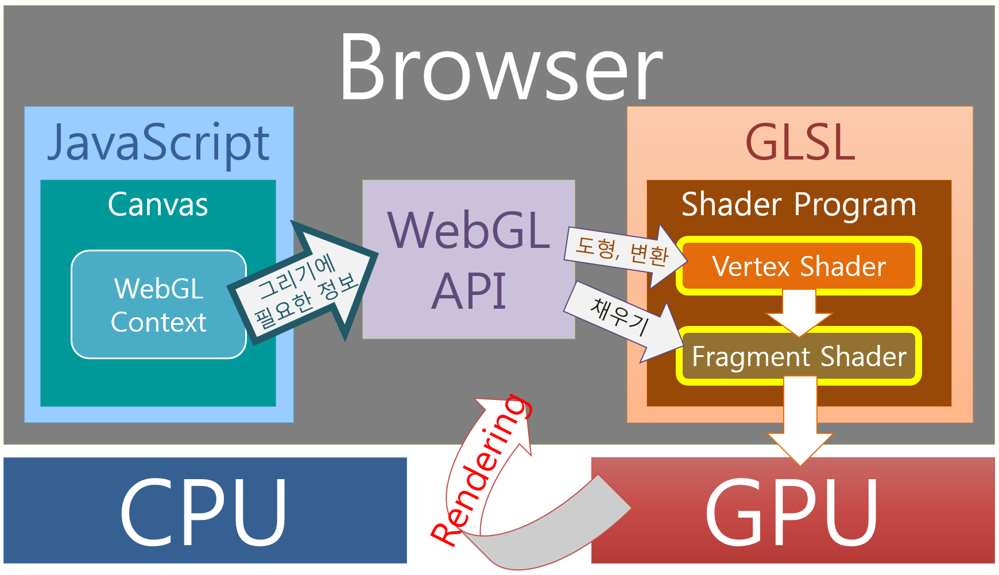

# WebGL Study

웹의 미래, WebGL을 공부하는 공간

## 예제 모음

소스는 src 폴더 아래에..

### Geometry

><a href='http://hanmomhanda.github.io/WebGL-Study/src/01-geometry/01-Drawing-a-Triangle.html' target='_blank'>01. 삼각형 그리기</a>

><a href='http://hanmomhanda.github.io/WebGL-Study/src/01-geometry/02-Drawing-a-Rectangle.html' target='_blank'>02. 사각형 그리기</a>

><a href='http://hanmomhanda.github.io/WebGL-Study/src/01-geometry/03-Pixel-Units.html' target='_blank'>03. 픽셀 단위 사용</a>


### Transformation

><a href='http://hanmomhanda.github.io/WebGL-Study/src/02-transformation/04-Translation.html' target='_blank'>04. 이동 변환</a>

><a href='http://hanmomhanda.github.io/WebGL-Study/src/02-transformation/05-Rotation.html' target='_blank'>05. 회전 변환</a>

><a href='http://hanmomhanda.github.io/WebGL-Study/src/02-transformation/06-Scale.html' target='_blank'>06. 스케일 변환</a>

><a href='http://hanmomhanda.github.io/WebGL-Study/src/02-transformation/07-Refactoring.html' target='_blank'>07. 리펙터링</a>

### Playground

><a href='http://hanmomhanda.github.io/WebGL-Study/src/03-playground/Drawing-a-Regular-Polygon.html' target='_blank'>정N각형 그리기</a>

><a href='http://hanmomhanda.github.io/WebGL-Study/src/03-playground/Dragging-a-Regular-Polygon.html' target='_blank'>정N각형 마우스 드래깅</a>

><a href='http://hanmomhanda.github.io/WebGL-Study/src/03-playground/Drawing-Modes.html' target='_blank'>그리기 모드(Begin Mode)</a>

><a href='http://hanmomhanda.github.io/WebGL-Study/src/03-playground/canvas2D-Rect.html' target='_blank'>Canvas2D</a>

><a href='http://hanmomhanda.github.io/WebGL-Study/src/03-playground/Shifting-Multiple-Triangles-Wrong.html' target='_blank'>잘못 구현한 WebGL</a>

><a href='http://hanmomhanda.github.io/WebGL-Study/src/03-playground/Shifting-Multiple-Triangles-Opt.html' target='_blank'>WebGL</a>


----------


# WebGL Primer

## 큰 흐름

- canvas에서 WebGL context를 얻어와서(보통 gl이라는 변수에 저장)
- WebGL context내의 여러 상수, 변수, 함수를 써서 그릴 정보를 WebGL API를 통해 shaderProgram에 담고
- drawArrays()나 drawElements()로 shaderProgram을 GPU에 보내면 GPU가 shaderProgram을 실행하면서 렌더링



## 정보 전달 흐름

- gl.bindBuffer(), gl.bufferData()로 그릴 정보(geometry, 색상, texture, ...)를 버퍼를 통해 WebGL context에 저장
- gl.bindBuffer(), gl.vertexAttribPointer()로 WebGL context에 저장된 그릴 정보를 shaderProgram 내에 선언된 변수에 저장
- 변환(이동, 회전, 스케일)에 필요한 벡터/행렬은 버퍼를 통하지 않고, uniform#fv()/uniformMatrix#fv()로 Shader에 보내고, 변환을 위한 계산을 Shader에서 수행하게 할 수 있고,
    - gl-matrix 라이브러리를 이용해서 JavaScript 내에서 변환을 계산하고, 계산한 결과를 Shader에 보내줄 수도 있으나, Shader에서 변환 계산을 하는 것이 성능 향상 효과가 훨씬 뛰어남
- gl.compileShader(), gl.attachShader(), gl.linkProgram()으로 Shader를 컴파일 및 링크해서 shaderProgram에 저장
- gl.drawArrays()나 gl.drawElements()로 shaderProgram을 GPU에 보내면 GPU가 shaderProgram을 실행하면서 각 Shader내에 있는 계산을 수행하고 렌더링

## 상식과 조금 다른 것들 - 용어

- vertex

    >3D 공간에서의 꼭지점
    >
    >하나의 vertex는 기본적으로 x, y, z 좌표값으로 구성되지만,
    >
    >동차 행렬을 사용하는 경우 x, y, z, a, b, c, ... 와 같이 사용될 수도 있음

- geometry

    >vertex로 구성되는 도형
    >
    >index buffer와 함께 하나 이상의 삼각형으로 구성

- fragment

    >vertex로 표현되는 geometry가 아닌 모든 것
    >
    >색, 텍스쳐 등

- Mesh

    >'그물망'이라는 뜻으로, 3D 공간에서 사물을 표현하는 객체로 기하 정보(geometry)와 표면 정보(surface)로 구성된다.
    >
    >3D 공간에서 위치를 나타내는 vertices로 구성되는 하나 혹은 그 이상의 다각형으로 구성되는 객체
    >
    >A mesh is an object composed of one or more polygonal shapes, constructed out of vertices (x, y, z triples) defining coordinate positions in 3D space.
    >
    >*Programming 3D Applications with HTML5 and WebGL*

- shader

    >GPU에서 구동되는 함수로 버퍼에 있는 데이터를 그리는 방법에 대한 내용이 포함된다.

    >`<script>` 태그 내에 문자열로 작성된 shader 소스 코드를 webGL context가 컴파일하고, 여러개의 shader가 program에 link되어 GPU에서 구동된다.

- program

    >WebGL context가 컴파일한 여러 개의 shader를 링크하고, CPU에서 지정해준 정보와 링크한 shader를 GPU에 전달하는 역할
    >
    >program에 shader도 붙이고, vertexPosition, matrix, color도 program의 property 값으로 지정하고, GPU는 program에서 해당 정보를 읽어와서 처리

- buffer

    >vertex, index, color 정보를 담는 버퍼

    >vertex, color buffer는 shader의 attribute 변수로 전달되지만, index buffer는 attribute 변수로 전달되지 않는다.

    >실제 그래픽 카드의 메모리에 저장

## 상식과 조금 다른 것들 - 좌표계

### 일반적인 Web : 왼쪽 위가 원점, 오른쪽이 X축, 아래쪽이 Y축


### WebGL : 화면 가운데가 원점, 오른쪽이 X축, 위쪽이 Y축, Z축은 오른손 법칙에 따른다.

우상단과 좌하단의 점은 WebGL 기본 좌표계로는 (1, 1), (-1, -1)이지만, 위에 있는 일반적인 Web 그림과의 쉬운 비교를 위해 (200, 100), (-200, -100)으로 표시함


### UV 좌표계 : 왼쪽 아래가 원점, 오른쪽이 U축, 아래쪽이 V축

UV 좌표계는 면에 텍스쳐를 입힐 때 사용하는 좌표계로, 왼쪽 아래가 원점이며 값의 범위는 (0, 0), (1, 1)이다.


## 상식과 조금 다른 것들 - 행렬, 벡터 구성

### 열(column) 우선!!

행렬이나 벡터의 연산은 고딩/대딩 때 배운 것과 당연하게도 똑같다.

하지만, `mat#()`나 `vec#()`와 같은 셰이더의 함수를 통해 행렬이나 벡터를 구성하는 방법은 다르다!!

````
mat4(
    a, b, c, d,
    e, f, g, h,
    i, j, k, l,
    m, n, o, p
)
이 반환하는 행렬은
    a, b, c, d,
    e, f, g, h,
    i, j, k, l,
    m, n, o, p
이 아니라,
    a, e, i, m,
    b, f, j, n,
    c, g, k, o,
    d, h, l, p
이고,

vec3( a, b, c ) 가 반환하는 벡터는
    a, b, c
인 행 벡터가 아니라
    a,
    b,
    c
인 열 벡터다.
````
>즉, **채우는 순서**가 직관적으로 생각했던 행 우선(첫 번째 행부터 다 채우고 다음 행을 채우는)이 아니라 **열 우선(첫 번째 열부터 다 채우고 다음 열을 채우는)**이다.

이유는.. 추측하기로는 프로그램 언어는 일반적으로 행을 기준으로 구분하고, 하나의 행에서 좌에서 우로 기술하므로 3차원 좌표 역시 `(x, y, z)`로 기술하지만, 실제 수학적인 연산에서는 3차원 좌표는 열 벡터로 기술되어야 하기 때문인 것으로 보인다(엄밀하게는 점과 벡터는 다른 개념이지만, 여기서는 열 벡터를 단순히 n행 1열인 행렬이라는 개념으로 사용한다). 

````
x'  =   a, b, c,      x
y'  =   d, e, f,  *   y
z'  =   g, h, i       z

와 같이 수학책에서 익숙하게 봐왔던 형식이 되려면 좌표는 행 벡터가 아니라 열 벡터로 표시되어야 한다.
````

즉, 좌에서 우로 쓰더라도 채우기는 좌에서 우가 아닌 위에서 아래로 채워야 연산에 적합한 열 벡터가 생성되므로 열 우선으로 채우고, 벡터를 열 우선으로 채우니 행렬도 열 우선으로 채워야 일관성이 맞으므로 행렬 역시 열 우선으로 채우는 것으로 보인다.

예를 들어, 이동 변환 행렬은
````
1, 0, 0, tX,
0, 1, 0, tY,
0, 0, 1, tZ,
0, 0, 0,  1
```
이지만, 셰이더의 `mat4` 함수로 위의 이동 변환 행렬을 만들 때는
````
mat4(
    1, 0, 0, 0,
    0, 1, 0, 0,
    0, 0, 1, 0,
    tX, tY, tZ, 1
)
````
로 기술하는 이유가 바로 열 우선 채우기 방식 때문이다.

>참고 : http://en.wikibooks.org/wiki/GLSL_Programming/Vector_and_Matrix_Operations

### 동차 좌표계

동차 좌표계의 의미에 대해서는 다른 자료를 참고하고, 여기서는 쉽게 동차 좌표계란 n차원 좌표를 n+1 개의 좌표로 나타낸다는 정도로만 이해하고, 동차 좌표계를 왜 쓰는 지에 대해서만 알아보자.

어떤 점의 위치를 바꾸는 기본적인 선형 변환은 이동(translation), 회전(rotation), 스케일(scale) 변환이 있는데, 이 중 회전 변환과 스케일 변환은 다음과 같이 점을 나타내는 열 벡터에 행렬을 곱해서 계산할 수 있다.

예를 들어 한 점 (x, y)를 시계 반대 방향으로 60도 회전하고, x, y축 방향 크기를 모두 3배로 변환해서 얻는 점 (X, Y)는 아래와 같이 구할 수 있다.

````
X     cos(π/3)  -sin(π/3)     3  0     x    
   =                       *        *  
Y     sin(π/3)   cos(π/3)     0  3     y
````

하지만, 이동 변환은 행렬을 곱해서는 얻을 수가 없고, 동일한 형태의 열 벡터를 더해서 구할 수 있다. 점 (x, y)를 x, y 축으로 각각 a, b 만큼 이동한 점 (X, Y)는 아래와 같이 구할 수 있다.

````
X       x     a
   =       +   
Y       y     b
````
다른 변환은 행렬 곱으로 계산되는 데, 이동 변환만 벡터의 합으로 계산하면 복합적인 변환의 경우 식 구성이 대단히 지저분 해 질 수 있다.

하지만, 동차 좌표계를 쓰면 이동 변환마저 행렬의 곱으로 처리할 수 있다!!

````
X     1  0  a     x     x + a  
Y  =  0  1  b  *  y  =  y + b 
Z     0  0  1     1       1
````

동차 좌표계는 변환을 행렬의 곱으로 편리하게 처리하기 위해 사용한다.


## Transformation

>Affine변환된 열벡터 = 픽셀단위사용행렬\*Translation행렬\*Rotation행렬\*Scale행렬\*열벡터


>참고 : http://duriansoftware.com/joe/An-intro-to-modern-OpenGL.-Chapter-3:-3D-transformation-and-projection.html

````
(M1*M2)*M3 == M1*(M2*M3)

(M1*M2)*V1 == M1*(M2*V1)

M1*M2*M3*V1 == (M1*M2)*M3*V1 == M1*(M2*M3)*V1 == M1*M2*(M3*V1)
````


## Shader Variable Qualifiers

참조 : http://www.lighthouse3d.com/tutorials/glsl-tutorial/data-types-and-variables/

- const – The declaration is of a compile time constant


- attribute

    >버퍼를 통해 JavaScript에서 vertexAttribPointer()를 통해 전달 받은 vertex 및 color 값을 저장(index 버퍼는 attribute 변수로 전달되지는 않음)
    >
    >vertex shader에서만 사용되며 읽기 전용 값
    >
    >Global variables that may change per vertex, that are passed from the OpenGL application to vertex shaders. This qualifier can only be used in vertex shaders. For the shader this is a read-only variable. See Attribute section


- uniform

    >JavaScript에서 uniformMatrix#fv()를 통해 전달 받은 값을 저장하며 주로 변형(이동, 회전, 스케일)을 계산하기 위한 벡터가 넘어옴
    >
    >vertex shader, fragment shader 모두 사용되며 읽기 전용 값
    >
    >Global variables that may change per primitive (may not be set inside glBegin,/glEnd), that are passed from the OpenGL application to the shaders. This qualifier can be used in both vertex and fragment shaders. For the shaders this is a read-only variable. See Uniform section

- varying

    >vertex shader에서 계산된 값을 fragment shader로 전달해 줄 때 사용
    >
    >vertex shader와 fragment shader에서 동일한 변수명으로 선언되어야 전달이 가능하다.
    >
    >vertex shader에서는 쓰기도 가능, fragment shader에서는 읽기 전용
    >
    >used for interpolated data between a vertex shader and a fragment shader. Available for writing in the vertex shader, and read-only in a fragment shader. See Varying section.
    >
    >Varying variables provide an interface between Vertex and Fragment Shader. Vertex Shaders compute values per vertex and fragment shaders compute values per fragment. If you define a varying variable in a vertex shader, its value will be interpolated (perspective-correct) over the primitve being rendered and you can access the interpolated value in the fragment shader.
    >
    >Varying can be used only with the data types float, vec2, vec3, vec4, mat2, mat3, mat4. (arrays of them too.)


## WebGL Context 주요 함수 - 파악 중임

- createBuffer()

    >https://www.khronos.org/opengles/sdk/docs/man/xhtml/glGenBuffers.xml
    >
    >버퍼 객체 생성

- bindBuffer(target, bufName)

    >https://www.khronos.org/opengles/sdk/docs/man/xhtml/glBindBuffer.xml

    - target : [gl.ARRAY_BUFFER | gl.ELEMENT_ARRAY_BUFFER]으로 버퍼를 지정한다.
    - bufName : 버퍼 객체 이름
    - index buffer 객체는 gl.ELEMENT_ARRAY_BUFFER에 바인딩해야 한다.

    >버퍼 객체의 이름(bufName)을 target에 바인딩. target에 새로운 버퍼 객체 이름을 바인딩하기 전까지는 해당 target에 바인딩 되어있는 버퍼 객체가 계속 유효. 즉, 상태머신과 유사하게 동작

- bufferData(target, new Float32Array(vertices), gl.STATIC_DRAW)

    >https://www.khronos.org/opengles/sdk/docs/man/xhtml/glBufferData.xml
    >
    >현재 target에 바인딩 된 버퍼 객체를 위한 데이터 저장소를 만들고, 두 번째 인자로 받은 데이터를 새로 만든 데이터 저장소에 저장한다.

- getAttribLocation(shaderProgram, attribute변수명)

    >https://www.khronos.org/opengles/sdk/docs/man/xhtml/glGetAttribLocation.xml
    >
    >shaderProgram에 link된 vertex shader 내에서 attribute변수명 변수가 선언된 순서값(0부터 시작하는 index) 반환
    >반환된 index 값은 나중에 vertexAttribPointer()의 첫번째 인자로 사용

- enableVertexAttribArray(attribute변수index)

    >https://www.khronos.org/opengles/sdk/docs/man/xhtml/glEnableVertexAttribArray.xml
    >
    >attribute변수index : getAttribLocation(shaderProgram, attribute변수명)의 반환값. 0이면 shader에서 첫번째로 선언된 attribute 변수에 할당될 배열을 렌더링 될 수 있게 한다.
    >
    >If enabled, the values in the generic vertex attribute array will be accessed and used for rendering when calls are made to vertex array commands such as glDrawArrays or glDrawElements.

- getUniformLocation(shaderProgram, attribute변수명)

    >https://www.khronos.org/opengles/sdk/docs/man/xhtml/glGetUniformLocation.xml
    >
    >위 링크의 내용과 달리 webGL에서는 integer가 아닌 WebGLUniformLocation 라는 객체 반환
    >반환된 index 값은 나중에 uniformMatrix4fv()의 첫번째 인자로 사용

- vertexAttribPointer(attribute변수index, vertSize, 변수타입, boolean, stride, offset)

    >https://www.khronos.org/opengles/sdk/docs/man/xhtml/glVertexAttribPointer.xml

    - vertSize는 2차원 좌표계를 사용하면 2, 3차원 좌표계를 사용하면 3이다.
    - 변수 타입은 vertexBuffer안에 있는 배열 원소의 데이터 타입(gl.FLOAT 등)
    - boolean은 넘겨지는 데이터가 자동으로 정규화 되어야 하는 지 여부. 고정소수점 데이터의 정규화 여부. 부호 있는 숫자는 [-1, 1] 사이 값으로 부호 없는 숫자는 [0, 1] 사이 값으로 정규화
    - stride는 연속된 generic vertex attribute 사이의 byte offset
    - offset는 배열에 있는 첫번째 generic vertex attribute의 첫번째 컴포넌트에 대한 인덱스 값

    >attribute변수index에 해당하는 변수에 현재 바인딩 되어 있는 배열(이 함수의 호출문 앞에서 gl.bindBuffer()로 바인딩 된 배열)을 저장하고, 해당 배열 정보를 바탕으로 렌더링 할 수 있도록, vertSize, 변수타입, 정규화여부, stride, offset 값을 지정해준다.
    >
    >program.attribute변수에 넣어진 값은 program을 통해 GPU에 전달된다.

- uniformMatrix4fv(program.uniform변수, boolean, 행렬)

    >openGL 스펙 링크가 없음. webGL에만 있는 듯.
    >
    >보통 변환(변형, 회전, 스케일)을 계산하기 위한 행렬을 Shader에 넘겨준다.
    >
    >행렬의 값을 전치(transpose, 행/열 변환) 여부에 따라 처리해서 program.uniform변수 에 넣어준다.
    >
    >program.uniform변수에 넣어진 값은 program을 통해 GPU에 전달된다.

- useProgram(shaderProgram)

    >https://www.khronos.org/opengles/sdk/docs/man/xhtml/glUseProgram.xml
    >
    >현재 렌더링 상태에 shaderProgram을 설치
    >
    >drayArrays()가 호출되면 shaderProgram이 GPU에 전달되어 GPU가 shaderProgram을 실행한다.(이건 추측)

- drawArrays(primitiveType, startIndex, nVerts)

    >https://www.khronos.org/opengles/sdk/docs/man/xhtml/glDrawArrays.xml

    - primitiveType : [GL_POINTS | GL_LINE_STRIP | GL_LINE_LOOP | GL_LINES | GL_TRIANGLE_STRIP | GL_TRIANGLE_FAN | GL_TRIANGLES]
    - startIndex : enabled 된 배열의 시작 인덱스
    - nVerts : 꼭지점 수, 삼각형은 3, 사각형은 4...

    >현재 WebGL context에 있는 정보를 토대로 렌더링한다.(추측 GPU로 shaderProgram을 전달한다)

- drawElements


## 그리기 모드

>

>출처 : http://www.informit.com/articles/article.aspx?p=2111395&seqNum=2


## 주요 상수

- gl.ARRAY_BUFFER

    >index buffer 외의 버퍼를 바인딩 할 수 있는 target

- gl.STREAM_DRAW

    >https://www.khronos.org/opengles/sdk/docs/man/xhtml/glBufferData.xml
    >
    >gl.bufferData()의 세 번째 파라미터인 usage에 사용되며 저장된 데이터가 어떤 방식으로 쓰이는 지 지정해주며, 버퍼 객체 성능에 큰 영향을 미친다
    >
    >버퍼 데이터 저장소에 있는 데이터를 한 번 수정해서 많아야 몇 번 사용하는 경우

- gl.STATIC_DRAW

    >https://www.khronos.org/opengles/sdk/docs/man/xhtml/glBufferData.xml
    >
    >gl.bufferData()의 세 번째 파라미터인 usage에 사용되며 저장된 데이터가 어떤 방식으로 쓰이는 지 지정해주며, 버퍼 객체 성능에 큰 영향을 미친다
    >
    >버퍼 데이터 저장소에 있는 데이터를 한 번 수정해서 여러번 사용하는 경우

- gl.DYNAMIC_DRAW

    >https://www.khronos.org/opengles/sdk/docs/man/xhtml/glBufferData.xml
    >
    >gl.bufferData()의 세 번째 파라미터인 usage에 사용되며 저장된 데이터가 어떤 방식으로 쓰이는 지 지정해주며, 버퍼 객체 성능에 큰 영향을 미친다
    >
    >버퍼 데이터 저장소에 있는 데이터를 여러 번 수정해서 여러번 사용하는 경우

- gl.FRAGMENT_SHADER

- gl.VERTEX_SHADER

- gl.COMPILE_STATUS

- gl.LINK_STATUS

- gl.COLOR_BUFFER_BIT

- gl.DEPTH_BUFFER_BIT

- gl.FLOAT

- gl.TRIANGLE_STRIP

- gl.DEPTH_TEST


-------
<a rel="license" href="http://creativecommons.org/licenses/by-nc-sa/4.0/"></a><br /><span xmlns:cc="http://creativecommons.org/ns#" property="cc:attributionName"><a href='https://www.facebook.com/hanmomhanda' target='_blank'>hanmomhanda</a></span>의 저작물인 이 저작물은(는) <a rel="license" href="http://creativecommons.org/licenses/by-nc-sa/4.0/">크리에이티브 커먼즈 저작자표시-비영리-동일조건변경허락 4.0 국제 라이선스</a>에 따라 이용할 수 있습니다.
